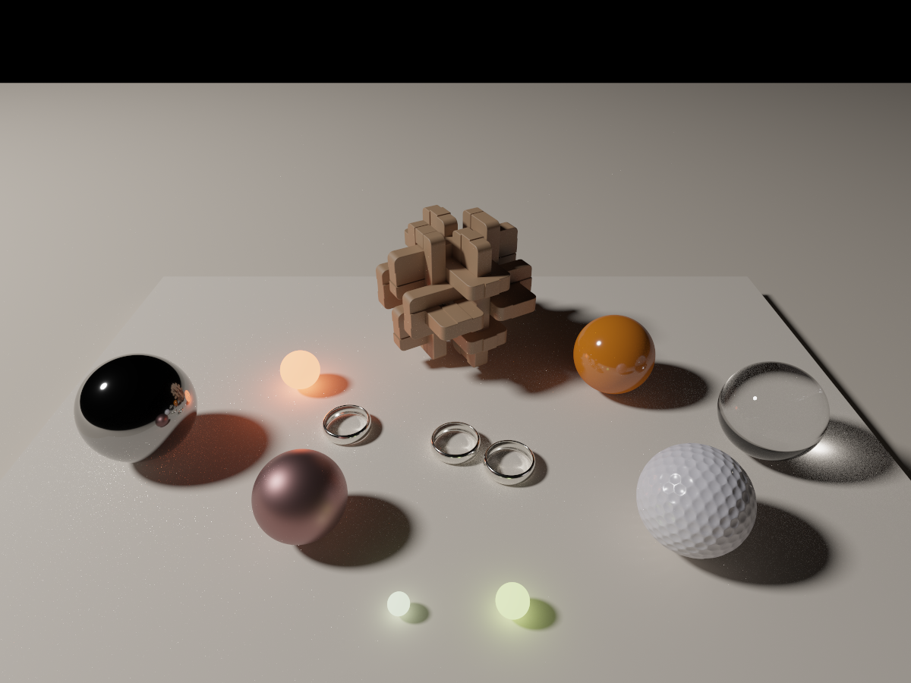
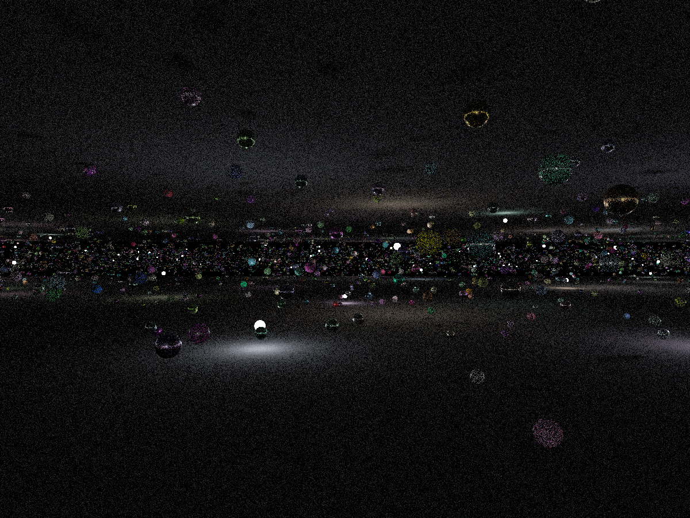
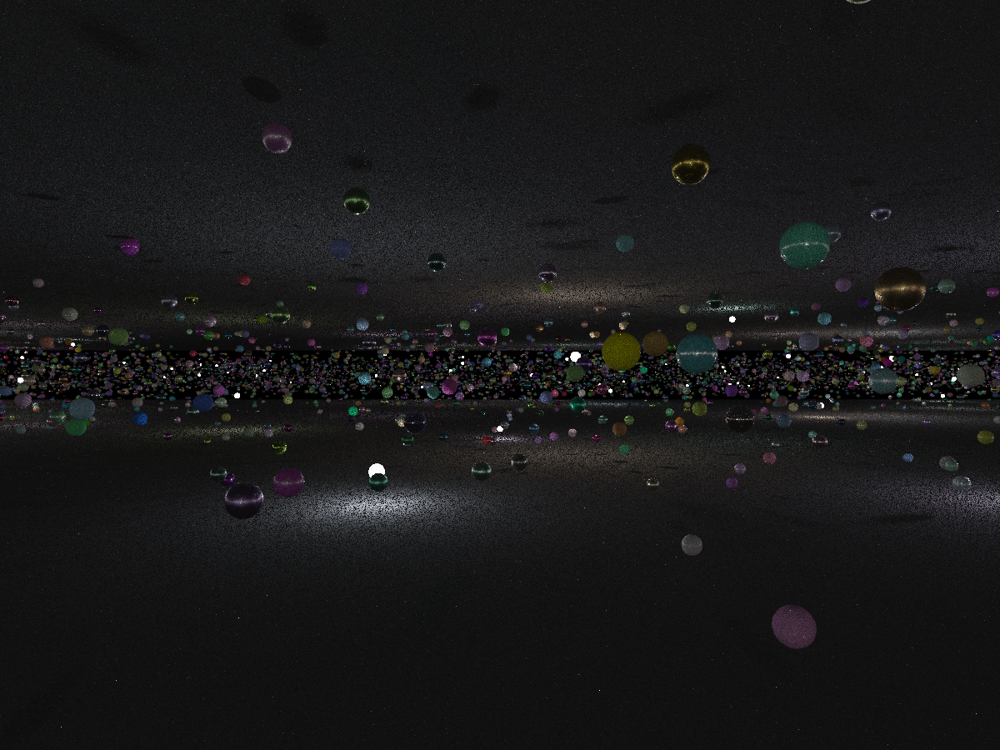
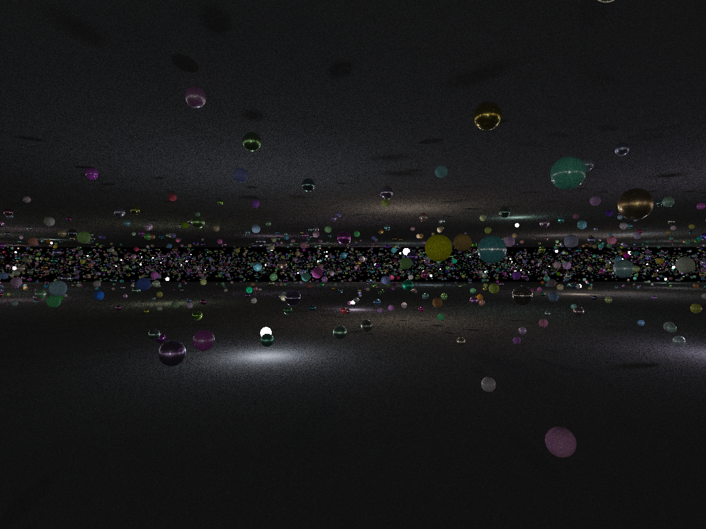
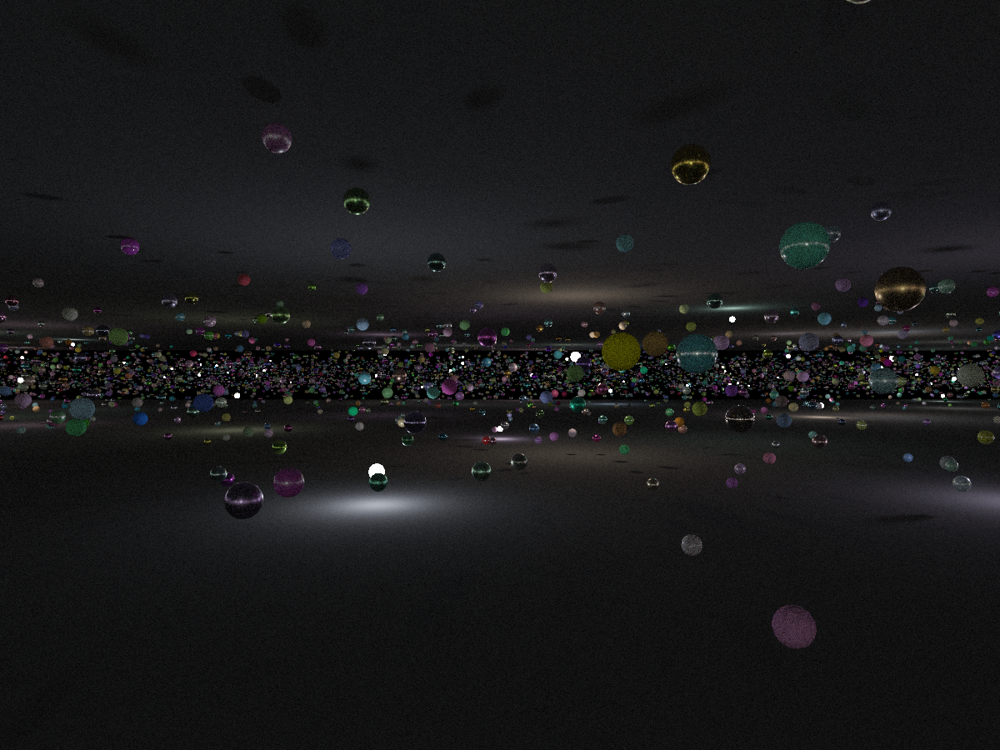
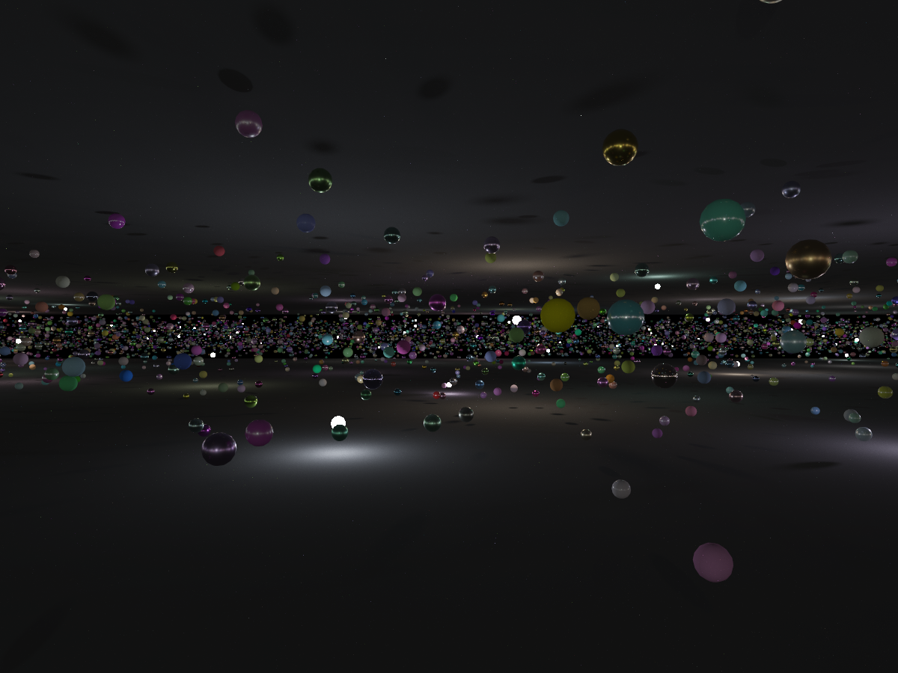

DXR PathTracer
==============
A DXR-based path tracer extended with Next Event Estimation (NEE), 
Multiple Importance Sampling (MIS), and Resampled Importance Sampling (RIS).

This implementation builds upon the original DXR PathTracer: https://github.com/meta-plane/DXR-PathTracer

The path tracing mode can be selected by modifying `PTType`
inside `DXRPathTracer::buildRaytracingPipeline()`:

- `0` — Baseline BRDF sampling
- `1` — NEE (Next Event Estimation)
- `2` — MIS (Multiple Importance Sampling)
- `3` — RIS (Resampled Importance Sampling, 32 proposals)

Results
------

Disney Hyperion's table test scene (https://www.disneyanimation.com/technology/innovations/hyperion)

16k spp

| **Brute Force** | **NEE** | **MIS** | **RIS** |
|:---------------:|:------:|:------:|:------:|
|  |  |  |  |

RIS Test scene
  
1024 spp

| **Brute Force** | **NEE** | **MIS** | **RIS** |
|:---------------:|:------:|:------:|:------:|
|  |  |  |  |

16k spp

| **Brute Force** | **NEE** | **MIS** | **RIS** |
|:---------------:|:------:|:------:|:------:|
|  |  |  |  |

